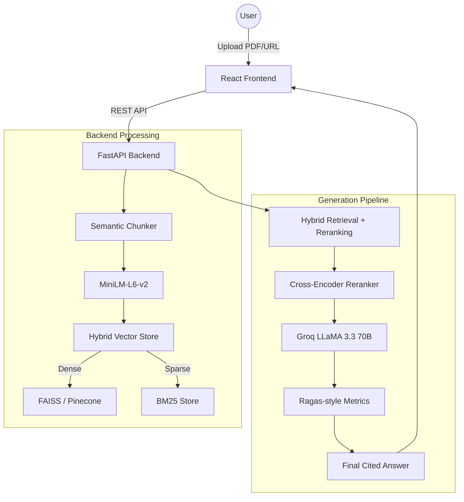

# 🔬 ResearchLens: Production-Grade AI Research Paper Analyzer

> **The ultimate SaaS-ready RAG platform for researchers.** 
> Understand complex papers in seconds with hybrid retrieval, cross-encoder reranking, and professional-grade evaluation metrics.

[](https://fastapi.tiangolo.com/)
[](https://reactjs.org/)
[](https://groq.com/)
[](https://pinecone.io/)
[](https://www.docker.com/)

---

## 🏗️ System Architecture

ResearchLens is built using a modern decoupled architecture, separating a high-performance FastAPI backend from a sleek, responsive React frontend.



---

## ✨ Premium Features

| Feature | Description |
|:---|:---|
| **⚡ Quick Summary** | One-click structured extraction of Problem, Methodology, Results, and Limitations. |
| **🔍 Full Paper Deep-Dive** | Generates an expert-level "masterclass" explaining the entire paper from background to future implications. |
| **🎯 Study & Interview Prep** | Generates exactly 5 challenging questions with elaborate, hidden answers to test your understanding. |
| **💡 Quick Insights** | Instant extraction of the top 5 key takeaways and core contributions. |
| **💬 Advanced Chat Q&A** | Conversational AI with citations, multi-turn history, and Beginner/Expert explanation modes. |
| **🔀 Methodology Flowchart** | Auto-generates visual Mermaid.js diagrams of the paper's architecture/pipeline. |
| **📊 Real-time Metrics** | Monitors Faithfulness, Answer Relevance, and Context Precision for every single response. |
| **🚀 Hybrid Retrieval** | Combines semantic (dense) and keyword (sparse) search for unmatched precision. |

---

## 🛠️ Technology Stack

### Backend (The Brain)
- **FastAPI:** High-performance, asynchronous REST API.
- **LangChain:** Orchestration framework for the RAG pipeline.
- **Groq API:** Utilizes **LLaMA 3.3 70B** for lightning-fast, high-quality reasoning.
- **Vector Stores:** 
  - **Local:** FAISS (in-memory) for privacy and speed.
  - **Cloud:** Pinecone for enterprise-level scalability.
- **Reranker:** Cross-Encoder (`ms-marco-MiniLM-L-6-v2`) for a 30%+ boost in retrieval accuracy.

### Frontend (The Face)
- **React 18:** Modern UI with efficient state management.
- **Vite:** Blazing fast build tool and dev server.
- **Tailwind-like Design System:** Premium glassmorphism dark theme.
- **Mermaid.js:** Real-time rendering of methodology flowcharts.
- **React-Markdown:** Beautiful rendering of LLM responses with syntax highlighting.

---

## 🚀 Installation & Running

### Prerequisites
- Python 3.11+
- Node.js 18+
- [Groq API Key](https://console.groq.com/keys) (Free)
- [Pinecone API Key](https://www.pinecone.io/) (Optional, for cloud storage)

### 1. Backend Setup
```bash
# Clone the repository
cd Rag_final

# Create and activate virtual environment
python -m venv venv
source venv/bin/activate  # Linux/Mac
venv\Scripts\activate     # Windows

# Install dependencies
pip install -r requirements.txt

# Configure environment
cp .env.example .env
# Edit .env with your Groq API Key

# Start the server
python -m uvicorn api.server:app --reload --port 8000
```

### 2. Frontend Setup
```bash
cd frontend
npm install
npm run dev
```
Open **[http://localhost:5173](http://localhost:5173)** to start analyzing.

---

## 🐳 Docker Deployment

The project is fully containerized and ready for production deployment.

```bash
docker-compose up --build
```
- **Frontend:** http://localhost:3000
- **Backend:** http://localhost:8000

---

## 💎 Why this project? (Career & Impact)

This project isn't just a simple wrapper; it's a **full-stack industrial RAG application**.

1. **Production-Ready Retrieval:** Implements Hybrid Search (BM25 + Dense) and RRF (Reciprocal Rank Fusion)—the same architecture used at companies like Google and Cohere.
2. **Scalability:** Built-in support for Pinecone allows the app to index thousands of documents effortlessly.
3. **Evaluation-Driven:** Integrates real-time metrics to combat hallucinations, a critical requirement for production AI.
4. **Professional UI:** Replaces the generic Streamlit interface with a custom-built React SaaS dashboard, demonstrating full-stack engineering skills.

---

## 📜 License
This project is licensed under the MIT License - see the [LICENSE](LICENSE) file for details.

---
**Developed with ❤️ for the Research Community.**